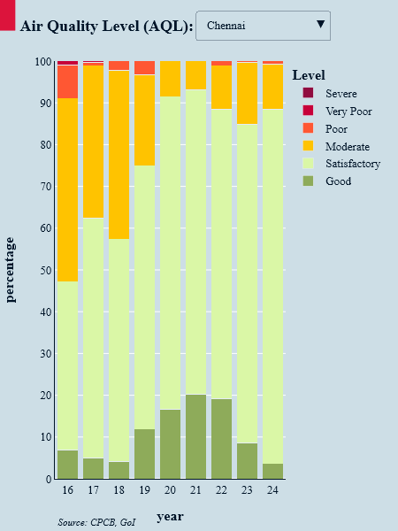

# INDAQ - India Air Quality

Monitor daily air quality updates to index, level, and prominent pollutant across different cities in India, sourced from the daily bulletin report of Central Pollution Control Board, Government of India.

---

Air Quality is a crucial tool to communicate the quality of air in a given area, indicating the level of pollution and its potential impact on public health. It is calculated based on the concentrations of eight prominent pollutants, namely, Particulate Matter (PM10 and PM2.5), Nitrogen Dioxide (NO2), Sulfur Dioxide (SO2), Carbon Monoxide (CO), Ozone (O3), Ammonia (NH3), and Lead (Pb). The estimation procedure involves continuous monitoring of these pollutants using a network of air quality monitoring stations across the country. Each pollutant's concentration is measured and then converted into a normalized index value using standard formulas and breakpoint tables provided by the Central Pollution Control Board (CPCB). The highest index value among the pollutants determines the overall AQI for that location. This value is then categorized into six levels—ranging from 'Good' to 'Severe'—to convey the health implications effectively to the public, aiding in the adoption of necessary precautio nary measures and policy decisions aimed at improving air quality.

**Figure.** Air quality index across different cities in India

The Air Quality Index (AQI) is given by:

$$
\text{AQI} = \max(\text{AQI}_ \text{PM2.5}, \text{AQI}_ \text{PM10}, \text{AQI}_ \text{NO2}, \text{AQI}_ \text{SO2}, \text{AQI}_ \text{O3}, \text{AQI}_ \text{NH3})
$$

$$
\text{AQI}_ \text{p} = \frac{(\text{I}_ \text{high} - \text{I}_ \text{low})}{(\text{C}_ \text{high} - \text{C}_ \text{low})} \times (\text{C}_ \text{p} - \text{C}_ \text{low}) + \text{I}_ \text{low}
$$

where:

- $\text{AQI}_\text{p}$ is the AQI for pollutant $p$.
- $\text{C}_ \text{p}$ is the concentration of pollutant $p$.
- $\text{C}_ \text{high}$ and $\text{C}_ \text{low}$ are the concentration breakpoints that bracket $\text{C}_ \text{p}$.
- $\text{I}_ \text{high}$ and $\text{I}_ \text{low}$ are the AQI breakpoints corresponding to $\text{C}_ \text{high}$ and $\text{C}_ \text{low}$.

**Figure.** Air quality level across different cities in India

**Table.** Air quality index and level and associated pollutant concenrtation range

| AQI Category  | AQI     | PM10    | PM2.5  | NO2    | O3      | CO     | SO2    | NH3     | Pb      |
|---------------|---------|---------|--------|--------|---------|--------|--------|---------|---------|
| Good          | 0-50    | 0-50    | 0-30   | 0–40   | 0-50    | 0-1.0  | 0-40   | 0-200   | 0-0.5   |
| Satisfactory  | 51-100  | 51-100  | 31-60  | 41-80  | 51-100  | 1.1-2.0| 41-80  | 201-400 | 0.5-1.0 |
| Moderate      | 101-200 | 101-250 | 61-90  | 81-180 | 101-168 | 2.1-10 | 81-380 | 401-800 | 1.1-2.0 |
| Poor          | 201-300 | 251-350 | 91-120 | 181-280| 169-208 | 10-17  | 381-800| 801-1200| 2.1-3.0 |
| Very Poor     | 301-400 | 351-430 | 121-250| 281-400| 209-748 | 17-34  | 801-1600| 1200-1800| 3.1-3.5|
| Severe        | 401-500 | 430+    | 250+   | 400+   | 748+    | 34+    | 1600+  | 1800+   | 3.5+    |

CO in mg/m3 and other pollutants in μg/m3; 24-hourly average values for PM10, PM2.5, NO2,SO2, NH3, and Pb, and 8-hourly values for CO and O3.

**Figure.** Prominent pollutant across different cities in India
